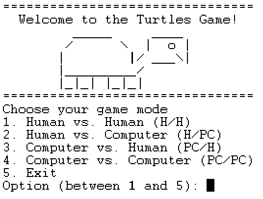
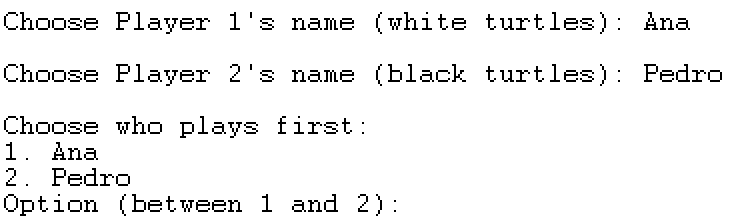
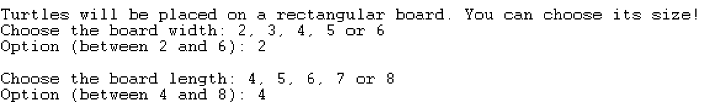
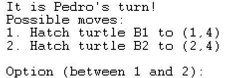

# Functional and Logic Programming - 3rd Year 1st Semester - 2nd Project (TP2)

## Game

**turtles**, as described by the creator in the [official website](https://turtlesgame.xyz/), is a game of turtles colliding in three dimensions.

## Group T12G02

Guilherme Moura Pinho Andrade Silva, <up202205298@up.pt>

Valentina Pereira Cadime, <up202206262@up.pt>

## Contribution

## Guilherme Silva (50%)

- `game.pl`, `auxiliary.pl` and respective documentation
- `move`

## Valentina Cadime (50%)

- `display.pl`, `io.pl` and respective documentation
- `valid_move` for hatch moves (`valid_hatch`), `value`
- `README`

## Installation and Execution

### Linux

Install `SICStus Prolog 4.9.0`. After downloading the necessary game files, and making sure they are all in the same directory, open the Linux terminal and go to the directory of the SICStus installation. Run the following command: `./sicstus`. Then, run `load_files('<absolute path to game.pl>').`. Finally, run `play.` to start the game.

### Windows

Install `SICStus Prolog 4.9.0`. After downloading the necessary game files, and making sure they are all in the same directory, run the SICStus app and consult the `game.pl` file. Then, proceed to run `play.` to start the game.

## Description of the game

`turtles, a game of turtles colliding in three dimensions` is a competitive two-player game, where the players have to face each other to win the game.

**Goal:** Get 3 of your turtles in the opponent's nest.

### How to start the game

The menu of the game will include all the gameplay options available at the moment: Human vs. Human `(H/H)`, Human vs. Computer `(H/PC)`, Computer vs. Human `(PC/H)`, Computer vs. Computer `(PC/PC)`. Choose a number between 1-4 to play the respective gamemode, otherwise write 5 to `exit` the game.

If you choose to have human players, the game will ask for their `names`. If you have PC bots, the game will ask for the game `difficulty`. If you have two human players, then the game will ask `who shall start` the game (player 1 or 2).

Besides, it will ask which `size of the board` the game will be played. Any gamemode will have the options of `2, 3, 4, 5 and 6` for the board width and `4, 5, 6, 7 and 8` for the board length. The original board game is 2 columns by 4 rows.

After the configuration of the game, the game will start.

### Understanding the board and turtles

A turtle is represented by a letter, `W` or `B`, and a number. The number represents the weight, size and power of the turtle and it is between 1 to 5. The number will be useful while deciding which turtle is best to move.

Each player has 5 turtles that they can move on the board. Firstly, each player will have all of their turtles placed inside their nest (outside the board, facing lengthwise). The white turtles, represented by W, will belong to the first player and will start from the first row ( their nest will be below the board). Consequently, the black turtles, represented by B, will belong to the second player and will start on top row of the board (the nest will be above the board).

**How to win:**

To win the game, the players must hatch their turtles and move them to the other side of the board, to the point they reach the enemy nest. Three turtles are needed to pass to the enemy's nest to win the game. During the game, the players will take turns and decide which move one of their turtles needs to make. The first one to complete the goal will win the game.

### Turtle Movements

- `Hatch` - If there is at least one turtle inside the nest, the player can hatch the turtle. This will make the turtle leave the nest, and be place on the respective edge of the border. The player can choose which turtle to hatch and in which column the turtle will be placed.

- `Normal move` - If any turtle is inside the board, the player can move it in any possible direction: up, down, left, right. The turtle must not leave the board by its own move, unless it is to move to the enemy's nest, scoring a point.

- `Fall` - When a turtle leaves the board because of an enemy turtle, we can say the turtle fell off the board. Any fallen turtle will be placed again in the nest, awaiting to be hatched again.

- `Encounter` - When a turtle is placed or moves inside the board, the turtle can encounters a non-empty cell. In other words, the cell where the player wants to move a turtle, might have already a turtle or a group of turtles stacked on top of each other. The interaction that follows the turtles encounter can be varied.

- `Stack` - If the player turtle has a lower number than the turtle that was already there, then it can jump on the turtles back, forming a stack. The player turtle will be on the top of the stack. However, the turtle on the bottom is the one that controls the moves of the stack. So beware which turtle will be your taxi driver: it could be your opponent's turtle or your own. Other turtles can also stack on top of you of they have an even lower number.

- `Normal move being the turtle driver of the stack` - If the player turtle is on the bottom of the stack, it can move to any cell direction, bringing with it the rest of the stacked turtles. In the other hand, if the combined weight of the turtles above the player turtle is equal or greater than the player turtle weight, then the turtle cannot move - It's stuck! Until one of the top turtles leaves the stack, the player can't move the stack of turtle.

- `Push` - If the player turtle wants to move to a cell, but the cell is occupied by turtle or a turtle stack, the player turtle can move to that position and push the other turtles to another cell in the same-direction of the movement. This can only happen, if the player turtle has an equal or greater number than the combined stack of turtles currently there. This can even happen, if the turtle just hatched and wants that place. Nevertheless, if, for example, the player turtle is carrying a stack of turtles, their combined weight doesn't matter to the push - only the driver turtle number is consider to push turtles. Ultimately, the player turtle can push turtles over any sides of the board, hence making them fall off the board. The pushing can also create a sequence of pushes, like the butterfly effect.

- `Climb and push` - If a player turtle carries a stack, and encounters another turtle stack, the player turtle stack can push some of the other turtles to climb on top of the remaining. This only happens, if the player turtle has an equal or greater number than some of the encountered stacked turtles, but not from all of them. In other words, if the turtle player sees a turtle in the middle of the stack that is greater number than them, the player turtle can push the other turtles off the stack, so that the player turtle stack can thrive on top of that one's back. Of course, the player turtle must be strong enough to push the combined weak turtles that wants to get rid off (as normal push).

- `Smash` - If the player turtle makes another turtle move in one direction, but that turtle cannot be pushed or stacked, then the player turtle gets smashed :(. The turtle will leave the board and go back to its nest to be hatched again. It the player turtle had other turtles on top, those will also be smashed and redirected to the respective nest.

### Important Notes

- The movement caused by a turtle can't make the board look the same as its turn before. For example if turtle A pushes turtle B, turtle B cannot push turtle A, since the game would be back to the same game stage. Basically, it is 'illegal' to undo the opponent's last move.

- If a player has no available movements, then they loose and the game is over.

- If the player turtles happen to stay 3 times in the same position, the game ends in a draw. In other words, if the game movements repeats on itself, to the point the players are in cyclic positions, then there's no point in the continue the game. Nobody likes to watch a chess piece move only back and forth - it is not fun.

### More information

For more information, visit the [official website](https://turtlesgame.xyz/), which also includes an instructive video of the game.

## Considerations for game extensions

Compared to the original game, we have expanded the rules so they could fit more size boards. In particular, the player can choose which width and length they would like to play the game. The available widths are 2, 3, 4, 5 and 6 cells, and the optional lengths are 4, 5, 6, 7 and 8. The width and length are independent from each other, thus, the player has even more freedom of choice.

Currently, there are neither additional rules for expert players, nor simplified rules for novice players.

## Game Logic

Since we are creating a game in a purely logic programming language, we have to change the way we normally implement a game. Therefore, the main design decisions regarding the implementation of the game logic were dependent on the following topics.

### Functionality Organization Among Game Files

To ease the management of all the clauses created for the game, we divided the clauses in different files grouped by their functionality.

- `io.pl` - holds all the rules needed to obtain the **input** of the user: number or string. More information about input validation in **User Interaction** topic.

- `display.pl` - holds all the rules necessary to write or display the game menu, board, prompts, state of the game, and others. It serves as an **output** to the SICStus console.

- `auxiliary.pl` - holds auxiliary rules and compound terms for the other files. It contains **Stack Logic, Game Logic** for Turtle Manipulation, and **Board Logic** for Board Manipulation.

- `game.pl` - holds most of the game logic like game configuration, initialization, manipulation and more. It serves as the central file that consults the rest of the files.

### Game Configuration Representation

The game configuration is represented by a compound term named game_config. It holds, 5 variables, namely: **Width, Length, Player1Name-Player1Level, Player2Name-Player2Level, FirstPlayerChoice**.

- The Width and Length are used to initialize the game board inside `initial_state`, using `init_board`.

- The last variable, FirstPlayerChoice, is used to store the player who will play the first turn of the game, which is decided by the user by input.

> If gamemode is H/H, then the user must choose which player plays first. Otherwise, if only one human player plays, then it automatically has the first turn. In PC/PC, first PC plays the first turn.

- The remaining 2 variables are tuples that represent the 2 players. Each tuple has 2 elements: the player name, selectable if its a human player, and the player level, which represents the type of player and it can be `human, easy (Computer Bot) or hard (Computer Bot)`. Besides this, the game uses the name of the players to print the start of the game inside `initial_state`.

**The content of game_config will be passed directly or indirectly to game_state by the initial_state predicate.**

### Internal Game State Representation

The internal game state is represent by a compound term named game_state, and includes the following variables: **Turn, Nest1-Nest2, Board, Scored1-Scored2, Player1Name-Player1Level, Player2Name-Player2Level**.

- The first variable, `Turn`, represents the current player turn, whether it is computer or human playing the game. Firstly, it is set in `initial_state` with the choice the user provided while configuring the game (game_config). Then, the game will switch the players who can play. Indeed, this is a game of turns, thus if player 1 just played, then player 2 will play, and vice-versa. The turns will stop changing when the game is over, by one of the players winning or having a draw.

- `Nest1-Nest2` is a tuple with 2 elements, each representing the nests of the players. Initially, it is set as a tuple of lists filled with the 5 turtles: `[white-1,white-2,white-3,white-4,white-5]-[black-1,black-2,black-3,black-4,black-5]`(the colors represent the turtles owned by each player; the number represents the power, size or weight of the turtle). While playing the game, the players will have the chance to hatch the turtles and use them to win the game. The action of hatching a turtle represents removing the turtle from the nest, hence placing it in the edge of the board. During the game, there is a possibility the nests will be empty, `[ ]-[ ]`, and, thus, the player must use the turtles on the board to win.

- `Board` is the current board of the game state. It is a list of lists (Rows) of lists(Cells). Each cell may be empty, `[]` or contain at most 5 turtles, as if they were stack on top of each other5, for example: `[white-5,white-4,black-3,black-2,black-1]`. The width and length of the board depends on the input given by the player while configuring the game (see **Considerations for game extensions** for more in-depth). For instance, if the original size is chosen, 2 columns \* 4 rows, then the board will be set as `[ [[],[]], [[],[]], [[],[]], [[],[]] ]`.

> Note: the insertion of the turtles won't follow the same indexes as the coordinates printed. If turtle A is placed on cell (1,1) then the board will be `[ [[],[]], [[],[]], [[],[]], [[turtle A],[]] ]`. In other words, the insertion in the rows will be inverted, but the column insertion is normal (basically, it is flipped vertically). This looks unnatural at first. However, the printing of the board must have the lowest cell (1,1) in the bottom-left corner, which coincides with the order of the board.

- `Scored1-Scored2` is a tuple of 2 lists representing the turtles who reached the enemy's nest, hence scoring a point to the turtles' player. To win the game, the player must have 3 turtles inside their score list. The tuple is set, at first, as `[ ]-[ ]`, and will be filled with turtles during the game. E.g.: `[white-1,white-4]-[black-2,black-3,black-1]`.

- `Player1Name-Player1Level` and `Player2Name-Player2Level` are the same as set in game_config.

**The game state will be the sequence of one of the possible combinations that each atom can be. Therefore, there will be plenty of states the game can be at any moment, just like chess.**

### Move Representation

To represent the moves of turtles during the game, the game uses a compound term to represent the turtle that will move and the direction it will take: `Turtle-Direction`. The direction of the move can be decomposed in 2 unique terms:

> More on the Turtle representation in **Understanding the board and turtles**

- `hatch-ColNum` - Direction can be represented as a turtle hatching and the column the turtle will be placed on the board (row is dependent on the turtle color). E.g.: Turtle-(hatch-2).

- `normal_direction` - Direction can be represented as an arrow to the desired new cell location, if the turtle has been hatch before and it is placed on the board. The directions can be **up, down, left, right**, as described in `normal_directions/1`, in `game.pl`. This coincides in how the board is printed, since moving to the top of the board is up, moving down is reaching the bottom of the board, and so on. E.g.: Turtle-up.

#### move/3 predicate

To move a turtle, the game takes into account what type of Direction the player has decided for that turtle.

**Hatch move**

If it is a hatch move, the game has to know which player is currently playing (`nth1`), to know the row the turtle must be placed after hatching.

Afterwards, the game will decide the effects caused by the turtle hatching on that board cell (`move_hatch`). If the cell is empty, no effects occur, and the turtle can be placed on that cell. Otherwise, if the turtle encounters another turtle or stack of turtles, then the game must decide if the player turtle will climb on top, push the other turtles, or both (push and climb).

The effect of pushing turtles to a different cell will cause a chain reaction, and the game must handle the movement of the displaced turtles as well (they might also cause other turtles to be pushed). Eventually, the turtle hatching can cause other turtles to fall from the board, in particular, to make a stack of turtles enter the opponent nest, hence scoring a goal. Thus, the game must also take into account the possibility of scoring with an hatch movement. Moreover, if the stack of displaced turtles cannot climb,push or move to an empty cell, then they will be smashed and returned to their nests, awaiting to be hatched again.

After all the effects are considered, and the chain reaction is complete, then the game will complete the hatching of the player turtle, by removing it from the nest (`remove_from_nest/4`). Besides, the turn will be switched to the other player.

> Several predicates are used to manipulate the move. See full documentation on **game.pl** and **auxiliary.pl**.

> Direction is mostly used for move/3 to obtain the Column Number the player turtle will hatch.

**Normal move**

If a turtle is already placed on the board, it can only do normal moves: up, down,left, right. The process is similar to hatch move, however, the turtle player could be carrying more turtles on its back, so the game has to move the whole stack, instead of a singular turtle `find_stack_to_move/5` predicate not only obtains the whole stack, but also the current coordinates of the player turtle stack. To obtain the destination coordinates, we use the `dest_coords/5` predicate, **which uses Direction and the current coordinates to calculate them**. Most of the manipulation is carried by the predicate `move_normal/12`.

> Although the chosen movement belongs to the list of valid moves, most of the validations are repeated in move_normal/12.

If the player turtle moves to the opponent's nest, the game must be able to handle the score, which includes adding the turtles to the score, and/or removing the opponent's turtles to their nest (Remember stacks can be composed of white and black turtles, in any sequence).

If no scoring is possible, at the moment, the game will check if the player turtle will move to an empty cell or will encounter other turtles. If the latter, then the game will check the effect of the player turtle moving to that cell: will it push, climb, or push and climb? The chain reaction can also happen, so the game must also handle it the same way.

If no movement is possible (happens when displaced turtles can't push, climb turtles or move to an empty cell), then the affected turtles will be smashed and returned to their nest, which is similar to hatch move. In addition, the game must also be able to handle fallen displaced turtles, from the chain reaction.

Finally, same as what happens while hatching a turtle, the game switches the player that will play next.

> Several predicates are used to manipulate the move. See full documentation on **game.pl** and **auxiliary.pl**.

### User Interaction

The game is composed of an initial menu which includes all the gameplay options available at the moment: Human vs. Human (H/H), Human vs. Computer (H/PC), Computer vs. Human (PC/H), Computer vs. Computer (PC/PC).

<p align="center">
    
</p>

A prompt will appear whenever the user has to make a decision. In this case, to choose a gamemode, the user must write a number between 1-4 respectively, otherwise write 5 to exit the game. To obtain the user input, the user doesn't have to add `.`, `""`, or anything related. In fact, **the user only needs to write their answer and press `Enter`**. If the user somehow writes something he shouldn't, the game will try again to obtain a answer until it is a valid one.

> To verify if an input number is valid, the game reads all the ASCII codes inserted on that line (`read_line`) and checks if each code belongs to a number character (from 48 to 57 in ASCII, or from 0 to 9 in decimal). If true, converts the ASCII code to decimal and adds it to the rest of the previously converted input. After obtained the number the user inserted in the correct format, the game will decide if it is between the interval of the current prompt (`between` from the library).

After chosen any gamemode, the game will ask for the names of the human players. The game will capture each username as a string.

<p align="center">
    
</p>

> To obtain the input string, the game will `peek` each character and verify if it is a newline, `\n`. If the user hasn't written at least one character other than `\n`, the game will try again to read the string. If in any moment the user inputs a character different than `\n`, and, then presses Enter, the game will automatically understand that's the total string. Thus, it will capture the string (without the \n), `reverse` it (the original string will be stored in reverse due to efficient head insertion), and store it as an atom (`atom_chars`). Finally, the game clears any input char that wasn't used for the atom (`clear_buffer`).

All the following interactions with the game will use the number option selection. For example, to choose the size of the board, or to decide which move to play next.

<div display="flex" align=center>
    
    
</div>

## Conclusions

After lots of work, we can conclude that the game present includes playing limitations compared to the original game. For example, we didn't had enough time to limit the game state to stop if the same game state has been happening in a cycle. We also didn't had time to complete the task of impeding the undo movement of the opponent. We believe there are several hidden bugs lying on the code, and we know improvements are possible, in particular, in the move/3 predicate and board display. We could also do an improved hard bot, to challenge more the experienced players. Anyway, with the limit time to complete the project, we did our best to fulfill all the requirements and organize and optimize the game as most as possible with tail recursion.

## Bibliography

### ChatGPT queries

**Query 1:** How to include variables' values in strings printed to console in SICStus prolog?

**Answer 1:** In SICStus Prolog, you can include variables' values in strings printed to the console using the format/2 or format/3 predicates. Here's an example:

```prolog
% Example using format/2
print_values(X, Y) :-
    format('The value of X is ~w and the value of Y is ~w.~n', [X, Y]).

% Example using format/3
print_values_with_stream(Stream, X, Y) :-
    format(Stream, 'The value of X is ~w and the value of Y is ~w.~n', [X, Y]).
```

In these examples:

- ~w is a placeholder for a term.
- [X, Y] is the list of variables whose values will replace the placeholders in the string.

You can call these predicates like this:

```prolog
?- print_values(10, 20).
The value of X is 10 and the value of Y is 20.
true.

?- open('output.txt', write, Stream),
   print_values_with_stream(Stream, 10, 20),
   close(Stream).
```

This will print the values of X and Y to the console or write them to a file.

**Query 2:** Give me a way to clear the terminal and put the output on top of the terminal in Prolog.

**Answer 2:**
To clear the terminal and put the output on top of the terminal in SICStus Prolog, you can use the clear ANSI escape code. Here is how you can do it:

```prolog
clear_terminal :-
    write('\e[H\e[2J').

% Example usage
example :-
    clear_terminal,
    write('This is the output on top of the terminal.').
```

When you run example/0, it will clear the terminal and then print the message at the top.

**Query 3:** Write me write/1 predicates that draw this ASCII art:

```plaintext
  _____     ____
 /      \  |  o |
|        |/ ___\|
|_________/
|_|_| |_|_|
```

**Answer 3:** Here is the write/1 predicates to draw the given ASCII art:

```prolog
draw_ascii_art :-
    write('  _____     ____'), nl,
    write(' /      \\  |  o |'), nl,
    write('|        |/ ___\\|'), nl,
    write('|_________/     '), nl,
    write('|_|_| |_|_|'), nl.
```

You can call draw_ascii_art to display the ASCII art.

**Query 4:** How to get a random element from a list in SICStus Prolog?

**Answer 4:** To get a random element from a list in SICStus Prolog, you can use the random_member/2 predicate. Here's an example:

```prolog
% Define a predicate to get a random element from a list
random_element(List, Element) :-
    random_member(Element, List).

% Example usage
?- random_element([a, b, c, d, e], X).
```

In this example, X will be unified with a random element from the list [a, b, c, d, e].

**Query 5:** Can this:

```prolog
translate_turtle(white-1, 'W1').
translate_turtle(white-2, 'W2').
translate_turtle(white-3, 'W3').
translate_turtle(white-4, 'W4').
translate_turtle(white-5, 'W5').
translate_turtle(black-1, 'B1').
translate_turtle(black-2, 'B2').
translate_turtle(black-3, 'B3').
translate_turtle(black-4, 'B4').
translate_turtle(black-5, 'B5').
```

be generalized into a single predicate?

**Answer 5:** Yes, you can generalize this into a single predicate by using a variable for the color and number. Here's how you can do it:

```prolog
translate_turtle(Color-Number, Code) :-
  sub_atom(Color, 0, 1, _, FirstLetter),
  number_chars(Number, NumberChars),
  atom_chars(NumberAtom, NumberChars),
  atom_concat(FirstLetter, NumberAtom, Code).
```

### Prolog documentation (SICStus)

[compound terms](https://sicstus.sics.se/sicstus/docs/3.12.4/html/sicstus/Compound-Terms.html)
[format predicate](https://sicstus.sics.se/sicstus/docs/4.9.0/html/sicstus/mpg_002dref_002dformat.html)
[between library](https://sicstus.sics.se/sicstus/docs/latest/html/sicstus.html/lib_002dbetween.html)
[consult predicate](https://sicstus.sics.se/sicstus/docs/3.7.1/html/sicstus_8.html)
[lists library](https://sicstus.sics.se/sicstus/docs/4.9.0/html/sicstus/lib_002dlists.html)
[Understanding input tools](https://sicstus.sics.se/sicstus/docs/4.9.0/html/sicstus/ref_002diou_002dcin.html)
[random library](https://sicstus.sics.se/sicstus/docs/4.9.0/html/sicstus/lib_002drandom.html)

> List of books, papers, web pages and other resources used during the development of the assignment. If you used tools such as ChatGPT, list the queries used.
